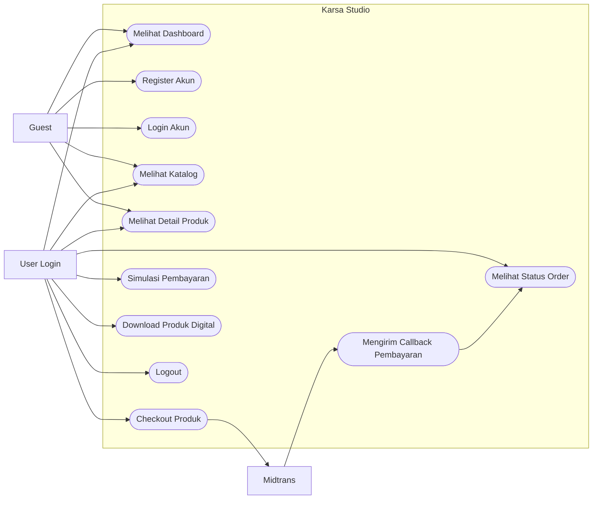
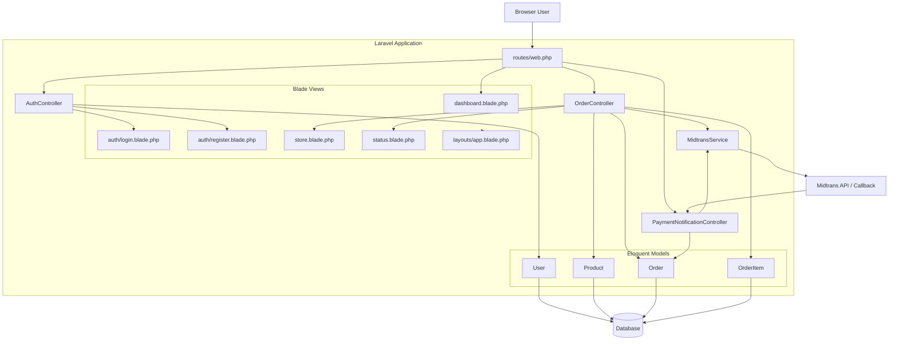
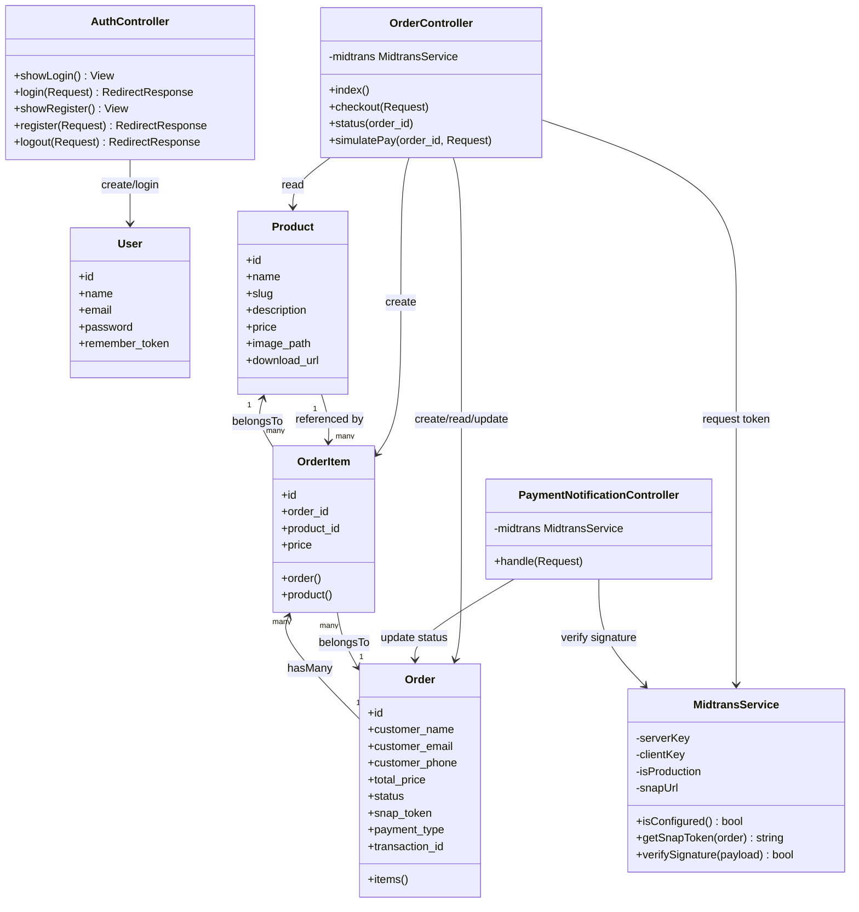
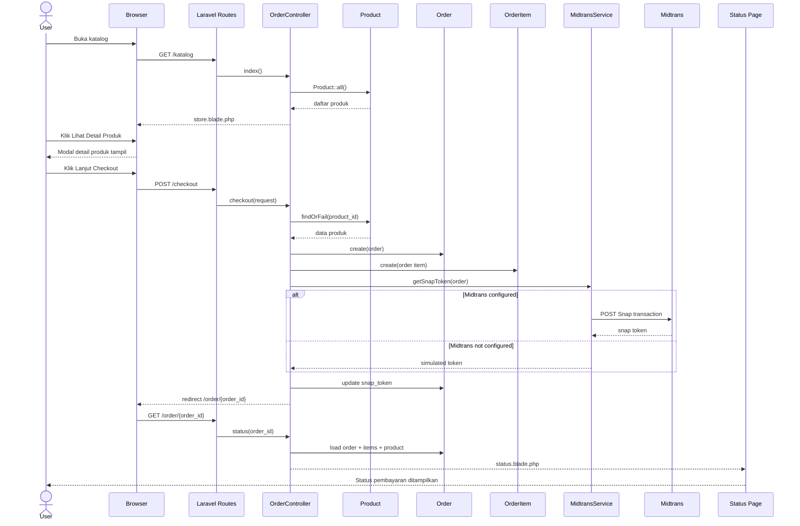
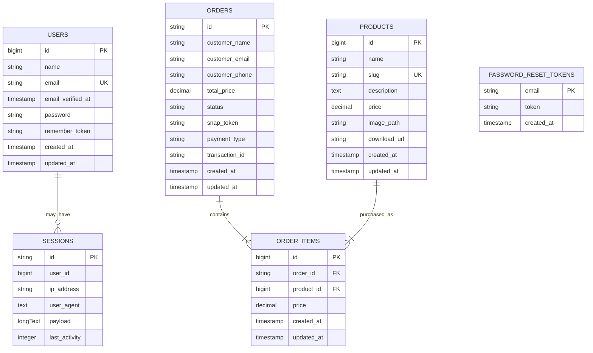

# UML Karsa Studio

Dokumentasi ini dibuat berdasarkan isi project Laravel **Karsa Studio**, yaitu aplikasi toko asset digital dengan fitur dashboard, autentikasi, katalog produk, detail produk, checkout, status order, simulasi pembayaran, dan integrasi callback Midtrans.

## 1. Use Case Diagram

Aktor utama pada aplikasi ini adalah **Guest**, **User**, dan **Midtrans** sebagai sistem pembayaran eksternal.



## 2. Activity Diagram

Alur utama aplikasi dimulai dari dashboard, masuk ke katalog, melihat detail produk, lalu checkout jika user sudah login.

    ```mermaid
    flowchart TD
        A([Mulai]) --> B[User membuka Dashboard]
        B --> C{Sudah login?}
        C -- Belum --> D[Login atau Register]
        D --> E[Dashboard menampilkan status akun]
        C -- Sudah --> E
        E --> F[User membuka Katalog]
        F --> G[User memilih Lihat Detail Produk]
        G --> H[Modal detail produk ditampilkan]
        H --> I{Lanjut checkout?}
        I -- Tidak --> F
        I -- Ya --> J{User sudah login?}
        J -- Belum --> D
        J -- Sudah --> K[Isi data checkout]
        K --> L[Sistem membuat Order]
        L --> M[Sistem membuat Order Item]
        M --> N[Sistem meminta Snap Token Midtrans]
        N --> O[User diarahkan ke Status Order]
        O --> P{Status pembayaran}
        P -- Pending --> Q[Bayar via Midtrans atau Simulasi Pembayaran]
        Q --> O
        P -- Paid --> R[Link download produk ditampilkan]
        P -- Expired atau Failed --> S[User dapat membuat order ulang]
        R --> T([Selesai])
        S --> T
    ```

## 3. Architecture Diagram

Arsitektur project memakai pola Laravel MVC dengan Blade untuk view, controller untuk proses bisnis, model Eloquent untuk database, dan service khusus untuk integrasi Midtrans.



## 4. Class Diagram

Diagram class berikut mengikuti file model, controller, dan service yang ada di project.



## 5. Sequence Diagram

Sequence ini menggambarkan proses utama saat user membeli produk dari katalog sampai status order dibuat.



## 6. ERD / Database Diagram

Database utama project terdiri dari tabel users, products, orders, order_items, sessions, dan password_reset_tokens. Relasi transaksi utama berada pada orders, order_items, dan products.



## Catatan Batasan Sistem

- Project saat ini belum memiliki fitur admin untuk CRUD produk.
- Checkout hanya membeli satu produk per order.
- Order belum terhubung langsung ke tabel users; data pelanggan disimpan di tabel orders sebagai `customer_name`, `customer_email`, dan `customer_phone`.
- Jika kredensial Midtrans belum dikonfigurasi, sistem memakai token simulasi dan fitur `simulatePay`.
